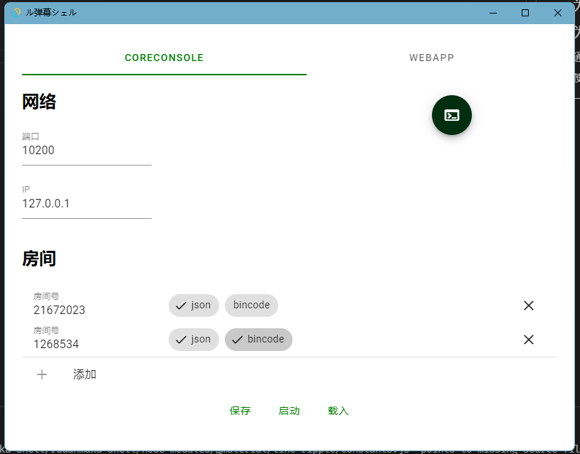
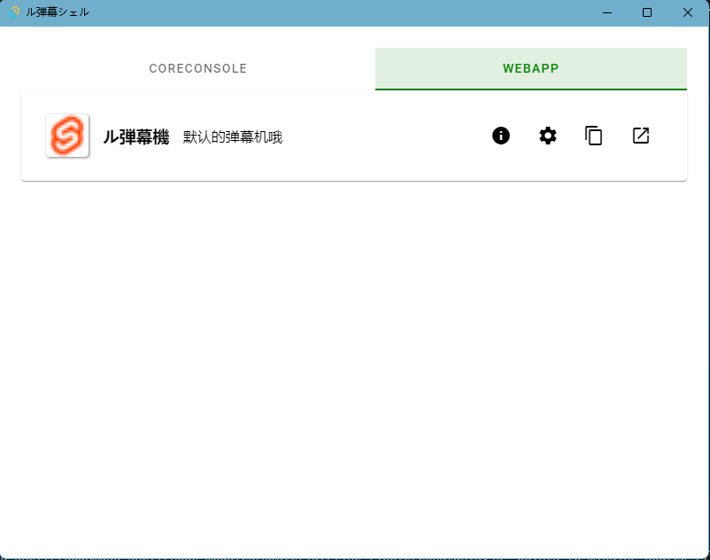
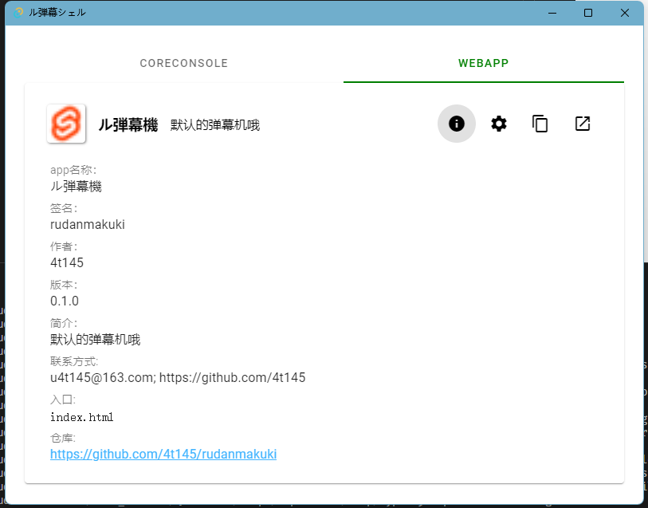
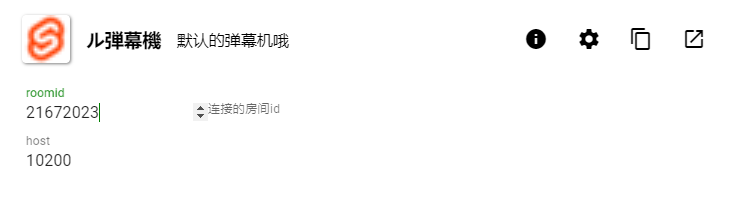
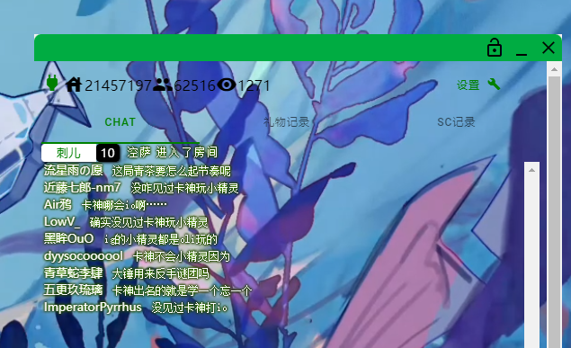

# Rudanmaku Shell
基于[Rudanmaku Core](https://github.com/4t145/rudanmaku-core)，提供第三方的bilibili直播间弹幕api支持！

**发行版本请移步网页右边release**
## 为Rudanmaku Core提供UI


## 为网页app提供一揽子支持
只需要把网页应用放在程序的`webapp`文件夹下，并且提供一个配置文件`package.toml`，就可以在shell中注册一个网页应用（如弹幕机等）

`package.toml`示例，对应效果
```toml
[package]
# name是唯一标识符，其在`webapp`路径下的文件夹名称请保持一致，请使用英文，-，数字组成
# 例子：myapp-myname-v20220505
name = "rudanmakuki"
# appname是显示的应用名称
appname = "ル弾幕機"
# 版本
version = "0.1.0"
# 作者，请注意这是一个数组，无请用空数组`[]`
authors = ["4t145"]
# 联系方式，请注意这是一个数组，无请用空数组`[]`
contact = ["u4t145@163.com", "https://github.com/4t145"]
# 一句话介绍以下这个webapp
brief = "默认的弹幕机哦"
# 入口，一般都是`index.html`
entry = "index.html"
# 仓库，没有可以不填这一项 
repo = "https://github.com/4t145/rudanmakuki"

# 这里是网页url search部分的参数，让用户可以在shell中配置
# 支持的类型: string|number|boolean
[[args.number]]
# 参数的key
key = "roomid"
# 参数的默认值
default = 21672023
# 参数的描述
description = "连接的房间id"
[[args.number]]
key = "host"
default = 10200
description = "core运行的host"

# 这样访问的页面url就会是`index.html?roomid=21672023&host=10200`
# 如果要添加字符串类型的参数，如下
[[args.string]]
key = "name"
default = "4t145"
description = "你的名字"

```
效果如下



### 通过SWS提供本地静态服务
会通过[SWS](https://github.com/joseluisq/static-web-server/)来serve`<可执行文件路径>/webapp`文件夹，因此你的网页应用的路径依赖请改为**相对的**

### 锁定功能|使用webview在新窗口运行
点击打开按钮，生成新窗口，提供锁定功能。

点击右上角锁定按钮，锁定后点击可以穿透窗口



### 一键生成链接供obs，浏览器使用
点击复制按钮，把生成的链接粘贴到剪切板，可以给浏览器或者obs使用，这样使得同一份app可以在原生窗口，obs，浏览器三处打开

链接可能是这样的：
`http://localhost:13000/rudanmakuki/index.html?roomid=21457197&host=10200`